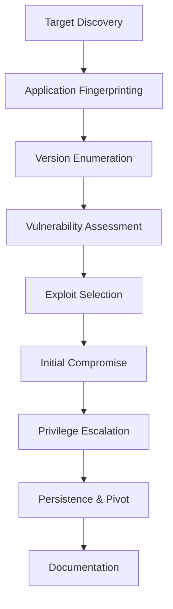

# ⚔️ Attacking Common Applications

> **🎯 Module Overview:** Comprehensive methodologies for identifying, enumerating, and exploiting the most prevalent applications encountered during penetration testing engagements.

## Module Introduction

During penetration tests, we frequently encounter the same applications across different environments. This module covers systematic approaches to attacking the most common applications, focusing on practical exploitation techniques and professional methodologies that deliver consistent results.

**Key Focus Areas:**
- **Discovery & Enumeration** - Identifying applications and gathering intelligence
- **Vulnerability Assessment** - Known CVEs, misconfigurations, and default credentials  
- **Exploitation Techniques** - Proven attack vectors and payload delivery
- **Post-Exploitation** - Privilege escalation and persistence within applications

---

## Module Structure

### 🌐 Content Management Systems (CMS)
* [WordPress Discovery & Enumeration](wordpress-discovery-enumeration.md)
* [WordPress Attacks & Exploitation](wordpress-attacks.md)
* [Joomla Discovery & Enumeration](joomla-discovery-enumeration.md)
* [Joomla Attacks & Exploitation](joomla-attacks.md)
* [Drupal Discovery & Enumeration](drupal-discovery-enumeration.md)
* [Drupal Attacks & Exploitation](drupal-attacks.md)

### ⚙️ Development & Build Tools
* [Tomcat Discovery & Enumeration](tomcat-discovery-enumeration.md)
* [Tomcat Attacks & Exploitation](tomcat-attacks.md)
* [Jenkins Discovery & Enumeration](jenkins-discovery-enumeration.md)
* [Jenkins Attacks & Exploitation](jenkins-attacks.md)

### 📊 Infrastructure & Network Monitoring
* [Splunk Discovery & Enumeration](splunk-discovery-enumeration.md)
* [Splunk Attacks & Exploitation](splunk-attacks.md)
* [GitLab/Git Repository Attacks](gitlab-attacks.md)

### 📊 Infrastructure & Monitoring
* [Splunk Discovery & Exploitation](splunk-attacks.md)
* [PRTG Network Monitor Attacks](prtg-attacks.md)
* [Grafana & Monitoring Tools](monitoring-tools-attacks.md)

### 🎫 Customer Service & Configuration Management
* [osTicket System Exploitation](osticket-attacks.md)
* [ServiceNow Discovery & Attacks](servicenow-attacks.md)
* [Configuration Management Platforms](config-management-attacks.md)

### 🔌 Web Interfaces & Gateways
* [Common Gateway Interface (CGI) Attacks](cgi-attacks.md)
* [API Gateway Exploitation](api-gateway-attacks.md)
* [Web Service Endpoints](web-services-attacks.md)

### 💻 Client Applications & Miscellaneous
* [Thick Client Application Analysis](thick-client-attacks.md)
* [Network Device Web Interfaces](network-device-attacks.md)
* [Virtualization Platforms](virtualization-attacks.md)

### 🎯 Comprehensive Skills Assessment
* [Multi-Application Assessment](skills-assessment.md)

---

## Key Learning Objectives

### 🔍 **Application Discovery**
- **Fingerprinting Techniques** - Identifying applications from minimal indicators
- **Automated Reconnaissance** - EyeWitness, Aquatone, and custom tooling
- **Manual Intelligence Gathering** - Source code analysis and behavioral patterns

### 🎯 **Systematic Enumeration**
- **Version Detection** - Precise version identification for vulnerability mapping
- **Plugin/Module Discovery** - Identifying third-party components and extensions
- **User Enumeration** - Valid username discovery and role identification

### ⚡ **Exploitation Methodologies**
- **CVE-Based Attacks** - Leveraging known vulnerabilities with public exploits
- **Configuration Attacks** - Default credentials and insecure settings
- **Logic Flaws** - Business logic vulnerabilities and application-specific bypasses

### 🚀 **Professional Workflow**
- **Engagement Planning** - Prioritizing targets based on business impact
- **Attack Chaining** - Combining vulnerabilities for maximum impact
- **Documentation Standards** - Professional reporting and evidence collection

---

## Tools & Techniques

### 🛠️ **Specialized Scanners**
- **WPScan** - WordPress security scanner
- **DroopeScan** - Drupal/Joomla enumeration
- **Nuclei** - Multi-technology vulnerability scanner
- **Custom Scripts** - Application-specific enumeration tools

### 🔧 **Manual Testing Tools**
- **Burp Suite** - Request manipulation and vulnerability testing
- **curl/wget** - Command-line HTTP testing
- **Browser Developer Tools** - Client-side analysis and debugging
- **Source Code Analysis** - Static analysis techniques

### 📊 **Intelligence Gathering**
- **Shodan/Censys** - Internet-wide application discovery
- **CVE Databases** - Vulnerability research and exploit availability
- **Vendor Security Advisories** - Official vulnerability disclosures

---

## Real-World Application

### 🏢 **Enterprise Environments**
- **Internal Networks** - Employee-facing applications and development tools
- **DMZ Applications** - Internet-facing portals and customer services
- **Cloud Platforms** - SaaS implementations and hybrid deployments

### 🌐 **External Penetration Testing**
- **Attack Surface Mapping** - Comprehensive application inventory
- **Priority Targeting** - High-impact applications for initial access
- **Lateral Movement** - Application-to-application privilege escalation

### 🎯 **Red Team Operations**
- **Persistence Mechanisms** - Maintaining access through applications
- **Data Exfiltration** - Leveraging application functionality for data theft
- **Covert Channels** - Using legitimate applications for command and control

---

## Methodology Framework

### **Phase 1: Discovery** 
- Port scanning and service identification
- HTTP/HTTPS service enumeration
- Application fingerprinting and categorization

### **Phase 2: Intelligence**
- Version detection and vulnerability mapping
- User enumeration and role identification  
- Plugin/module discovery and analysis

### **Phase 3: Assessment**
- CVE research and exploit availability
- Configuration analysis and default credentials
- Custom vulnerability testing

### **Phase 4: Exploitation**
- Exploit deployment and initial access
- Privilege escalation within applications
- Data extraction and environment mapping

### **Phase 5: Impact**
- Business impact assessment
- Lateral movement opportunities
- Professional documentation and reporting

---

## Success Metrics

### 🎯 **Technical Proficiency**
- **Application Recognition Speed** - Rapid identification of common platforms
- **Enumeration Thoroughness** - Complete vulnerability surface mapping
- **Exploitation Success Rate** - Consistent compromise of vulnerable applications

### 📊 **Professional Skills**
- **Methodology Consistency** - Repeatable approaches across engagements
- **Documentation Quality** - Clear, actionable findings and remediation guidance
- **Time Management** - Efficient allocation of testing time for maximum coverage

**💡 This module focuses on developing both technical exploitation skills and professional methodologies essential for successful application security assessments.** 