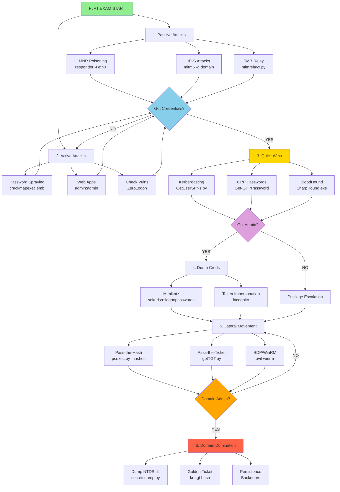

# PJPT Attack Flow - GitBook Version

## Attack Steps Reference

### 1. Initial Access
- [LLMNR Poisoning](llmnr-poisoning.md)
- [IPv6 Attacks](ipv6-attacks.md)
- [SMB Relay Attacks](smb-relay-attacks.md)
- [Passback Attacks](passback-attacks.md)

### 2. Post-Compromise
- [Kerberoasting](kerberoasting.md)
- [GPP Passwords](gpp-cpassword-attacks.md)
- [Token Impersonation](token-impersonation.md)
- [Domain Enumeration](domain-enumeration.md)

### 3. Credential Dumping
- [Mimikatz Overview](mimikatz-overview.md)
- [NTDS.dit Extraction](ntds-dit-extraction.md)

### 4. Lateral Movement
- [Pass Attacks](pass-attacks.md)
- [Pivoting Techniques](pivoting-techniques.md)

### 5. Privilege Escalation
- [Windows Persistence](windows-persistence-techniques.md)
- [Recent AD Vulnerabilities](recent-ad-vulnerabilities.md)

### 6. Post-Domain Compromise
- [Golden Ticket Attacks](golden-ticket-attacks.md)
- [Post-Domain Strategy](post-domain-compromise-strategy.md) 